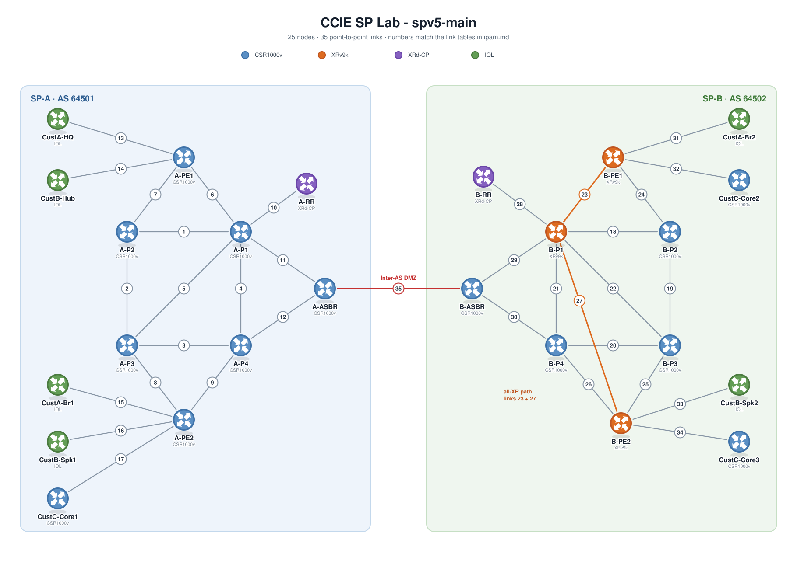

# IPAM

IPv4 and IPv6 allocation for the 25-node topology. Everything here matches the baseline configs in `lab_configs/`. The numbers in the first column of each link table are the link numbers on the diagram.

## Scheme

| Entity | IPv4 | IPv6 |
|---|---|---|
| SP-A infrastructure | 10.1.0.0/16 | 2001:db8:1::/48 |
| SP-B infrastructure | 10.2.0.0/16 | 2001:db8:2::/48 |
| Inter-AS DMZ | 10.255.0.0/30 | 2001:db8:ff::/64 |
| CustA | 10.10.0.0/16 | 2001:db8:10::/48 |
| CustB | 10.20.0.0/16 | 2001:db8:20::/48 |
| CustC | 10.30.0.0/16 | 2001:db8:30::/48 |

The 2nd octet of the IPv4 address is the entity ID: 1 = SP-A, 2 = SP-B, 10/20/30 = customers, 255 = DMZ. The 2nd hextet of the IPv6 address is the same ID in hex.

Within an SP block:

- `10.<SP>.0.R/32` and `2001:db8:<SP>::R/128` - router loopbacks, R = router ID 1-8
- `10.<SP>.1.X/30` and `2001:db8:<SP>:10::/64` onward - core point-to-point links
- `10.<SP>.10-12.X/30` and `2001:db8:<SP>:20::/64` onward - PE-CE links (10 = CustA, 11 = CustB, 12 = CustC)
- `10.<SP>.255.X/30` and `2001:db8:<SP>:ff::/64` - reserved

## Router IDs

All loopbacks are Loopback0, /32 and /128.

| Role | R | SP-A IPv4 | SP-A IPv6 | SP-B IPv4 | SP-B IPv6 |
|---|---|---|---|---|---|
| P1 | 1 | 10.1.0.1 | 2001:db8:1::1 | 10.2.0.1 | 2001:db8:2::1 |
| P2 | 2 | 10.1.0.2 | 2001:db8:1::2 | 10.2.0.2 | 2001:db8:2::2 |
| P3 | 3 | 10.1.0.3 | 2001:db8:1::3 | 10.2.0.3 | 2001:db8:2::3 |
| P4 | 4 | 10.1.0.4 | 2001:db8:1::4 | 10.2.0.4 | 2001:db8:2::4 |
| PE1 | 5 | 10.1.0.5 | 2001:db8:1::5 | 10.2.0.5 | 2001:db8:2::5 |
| PE2 | 6 | 10.1.0.6 | 2001:db8:1::6 | 10.2.0.6 | 2001:db8:2::6 |
| RR | 7 | 10.1.0.7 | 2001:db8:1::7 | 10.2.0.7 | 2001:db8:2::7 |
| ASBR | 8 | 10.1.0.8 | 2001:db8:1::8 | 10.2.0.8 | 2001:db8:2::8 |

## Customer loopbacks

| CE | IPv4 | IPv6 |
|---|---|---|
| CustA-HQ | 10.10.0.1/32 | 2001:db8:10::1/128 |
| CustA-Br1 | 10.10.0.2/32 | 2001:db8:10::2/128 |
| CustA-Br2 | 10.10.0.3/32 | 2001:db8:10::3/128 |
| CustB-Hub | 10.20.0.1/32 | 2001:db8:20::1/128 |
| CustB-Spk1 | 10.20.0.2/32 | 2001:db8:20::2/128 |
| CustB-Spk2 | 10.20.0.3/32 | 2001:db8:20::3/128 |
| CustC-Core1 | 10.30.0.1/32 | 2001:db8:30::1/128 |
| CustC-Core2 | 10.30.0.2/32 | 2001:db8:30::2/128 |
| CustC-Core3 | 10.30.0.3/32 | 2001:db8:30::3/128 |

## SP-A core links

The lower router-ID endpoint takes `.1` in IPv4 and `::1` in IPv6.

| # | Link | IPv4 /30 | Lower | Higher | IPv6 /64 |
|---|---|---|---|---|---|
| 1 | A-P1 ↔ A-P2 | 10.1.1.0/30 | A-P1=.1 | A-P2=.2 | 2001:db8:1:10::/64 |
| 2 | A-P2 ↔ A-P3 | 10.1.1.4/30 | A-P2=.5 | A-P3=.6 | 2001:db8:1:11::/64 |
| 3 | A-P3 ↔ A-P4 | 10.1.1.8/30 | A-P3=.9 | A-P4=.10 | 2001:db8:1:12::/64 |
| 4 | A-P1 ↔ A-P4 | 10.1.1.12/30 | A-P1=.13 | A-P4=.14 | 2001:db8:1:13::/64 |
| 5 | A-P1 ↔ A-P3 | 10.1.1.16/30 | A-P1=.17 | A-P3=.18 | 2001:db8:1:14::/64 |
| 6 | A-P1 ↔ A-PE1 | 10.1.1.20/30 | A-P1=.21 | A-PE1=.22 | 2001:db8:1:15::/64 |
| 7 | A-P2 ↔ A-PE1 | 10.1.1.24/30 | A-P2=.25 | A-PE1=.26 | 2001:db8:1:16::/64 |
| 8 | A-P3 ↔ A-PE2 | 10.1.1.28/30 | A-P3=.29 | A-PE2=.30 | 2001:db8:1:17::/64 |
| 9 | A-P4 ↔ A-PE2 | 10.1.1.32/30 | A-P4=.33 | A-PE2=.34 | 2001:db8:1:18::/64 |
| 10 | A-P1 ↔ A-RR | 10.1.1.36/30 | A-P1=.37 | A-RR=.38 | 2001:db8:1:19::/64 |
| 11 | A-P1 ↔ A-ASBR | 10.1.1.40/30 | A-P1=.41 | A-ASBR=.42 | 2001:db8:1:1a::/64 |
| 12 | A-P4 ↔ A-ASBR | 10.1.1.44/30 | A-P4=.45 | A-ASBR=.46 | 2001:db8:1:1b::/64 |

## SP-B core links

Same structure, second octet 2 and second hextet 2.

| # | Link | IPv4 /30 | Lower | Higher | IPv6 /64 |
|---|---|---|---|---|---|
| 18 | B-P1 ↔ B-P2 | 10.2.1.0/30 | B-P1=.1 | B-P2=.2 | 2001:db8:2:10::/64 |
| 19 | B-P2 ↔ B-P3 | 10.2.1.4/30 | B-P2=.5 | B-P3=.6 | 2001:db8:2:11::/64 |
| 20 | B-P3 ↔ B-P4 | 10.2.1.8/30 | B-P3=.9 | B-P4=.10 | 2001:db8:2:12::/64 |
| 21 | B-P1 ↔ B-P4 | 10.2.1.12/30 | B-P1=.13 | B-P4=.14 | 2001:db8:2:13::/64 |
| 22 | B-P1 ↔ B-P3 | 10.2.1.16/30 | B-P1=.17 | B-P3=.18 | 2001:db8:2:14::/64 |
| 23 | B-P1 ↔ B-PE1 | 10.2.1.20/30 | B-P1=.21 | B-PE1=.22 | 2001:db8:2:15::/64 |
| 24 | B-P2 ↔ B-PE1 | 10.2.1.24/30 | B-P2=.25 | B-PE1=.26 | 2001:db8:2:16::/64 |
| 25 | B-P3 ↔ B-PE2 | 10.2.1.28/30 | B-P3=.29 | B-PE2=.30 | 2001:db8:2:17::/64 |
| 26 | B-P4 ↔ B-PE2 | 10.2.1.32/30 | B-P4=.33 | B-PE2=.34 | 2001:db8:2:18::/64 |
| 28 | B-P1 ↔ B-RR | 10.2.1.36/30 | B-P1=.37 | B-RR=.38 | 2001:db8:2:19::/64 |
| 29 | B-P1 ↔ B-ASBR | 10.2.1.40/30 | B-P1=.41 | B-ASBR=.42 | 2001:db8:2:1a::/64 |
| 30 | B-P4 ↔ B-ASBR | 10.2.1.44/30 | B-P4=.45 | B-ASBR=.46 | 2001:db8:2:1b::/64 |
| 27 | B-P1 ↔ B-PE2 | 10.2.1.48/30 | B-P1=.49 | B-PE2=.50 | 2001:db8:2:1c::/64 |

## PE-CE links

The PE takes `.1`, the CE takes `.2`.

| # | Link | Customer | IPv4 /30 | PE side | CE side | IPv6 /64 |
|---|---|---|---|---|---|---|
| 13 | A-PE1 ↔ CustA-HQ | CustA | 10.1.10.0/30 | A-PE1=.1 | CustA-HQ=.2 | 2001:db8:1:20::/64 |
| 15 | A-PE2 ↔ CustA-Br1 | CustA | 10.1.10.4/30 | A-PE2=.5 | CustA-Br1=.6 | 2001:db8:1:21::/64 |
| 14 | A-PE1 ↔ CustB-Hub | CustB | 10.1.11.0/30 | A-PE1=.1 | CustB-Hub=.2 | 2001:db8:1:22::/64 |
| 16 | A-PE2 ↔ CustB-Spk1 | CustB | 10.1.11.4/30 | A-PE2=.5 | CustB-Spk1=.6 | 2001:db8:1:23::/64 |
| 17 | A-PE2 ↔ CustC-Core1 | CustC | 10.1.12.0/30 | A-PE2=.1 | CustC-Core1=.2 | 2001:db8:1:24::/64 |
| 31 | B-PE1 ↔ CustA-Br2 | CustA | 10.2.10.0/30 | B-PE1=.1 | CustA-Br2=.2 | 2001:db8:2:20::/64 |
| 33 | B-PE2 ↔ CustB-Spk2 | CustB | 10.2.11.0/30 | B-PE2=.1 | CustB-Spk2=.2 | 2001:db8:2:22::/64 |
| 32 | B-PE1 ↔ CustC-Core2 | CustC | 10.2.12.0/30 | B-PE1=.1 | CustC-Core2=.2 | 2001:db8:2:24::/64 |
| 34 | B-PE2 ↔ CustC-Core3 | CustC | 10.2.12.4/30 | B-PE2=.5 | CustC-Core3=.6 | 2001:db8:2:25::/64 |

## Inter-AS link

| # | Link | IPv4 /30 | A side | B side | IPv6 /64 |
|---|---|---|---|---|---|
| 35 | A-ASBR ↔ B-ASBR | 10.255.0.0/30 | A-ASBR=.1 | B-ASBR=.2 | 2001:db8:ff::/64 (=::1, ::2) |

## Management network

`172.20.30.0/24`, assigned by containerlab as `spv5-mgmt`. Not routed - SSH only.

| Node | Mgmt IPv4 |
|---|---|
| A-P1 … A-P4 | 172.20.30.11-14 |
| A-PE1, A-PE2 | 172.20.30.15, .16 |
| A-RR | 172.20.30.17 |
| A-ASBR | 172.20.30.18 |
| B-P1 … B-P4 | 172.20.30.21-24 |
| B-PE1, B-PE2 | 172.20.30.25, .26 |
| B-RR | 172.20.30.27 |
| B-ASBR | 172.20.30.28 |
| CustA-HQ / Br1 / Br2 | 172.20.30.101-103 |
| CustB-Hub / Spk1 / Spk2 | 172.20.30.111-113 |
| CustC-Core1 / 2 / 3 | 172.20.30.121-123 |

## AS numbers

| Entity | AS |
|---|---|
| SP-A | 64501 |
| SP-B | 64502 |
| CustA | 64510 |
| CustB | 64520 |
| CustC | 64530 |
