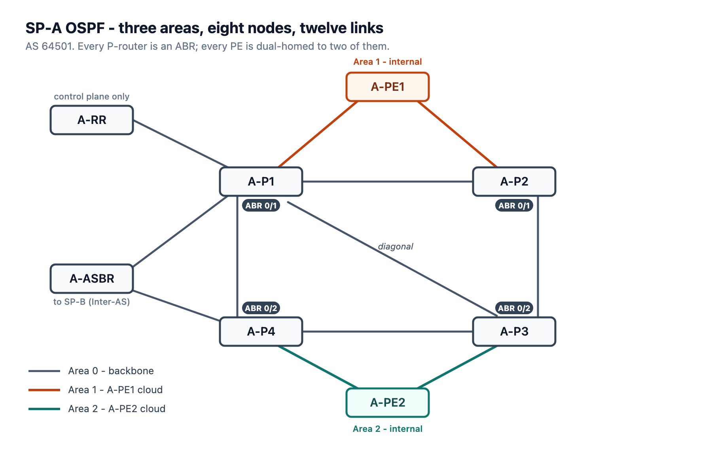

# Lab 01, Stage 1A - SP-A OSPF

Dual-stack IGP for SP-A (AS 64501): OSPFv2 and OSPFv3, three areas, eight nodes,
twelve links. Companion article: "SP-A IGP Foundation: Multi-Area Dual-Stack OSPF
for a Service Provider Core".



## Area map

| Link | Area |
|---|:--:|
| A-P1 - A-P2 | 0 |
| A-P2 - A-P3 | 0 |
| A-P3 - A-P4 | 0 |
| A-P1 - A-P4 | 0 |
| A-P1 - A-P3 (diagonal) | 0 |
| A-P1 - A-RR | 0 |
| A-P1 - A-ASBR | 0 |
| A-P4 - A-ASBR | 0 |
| A-P1 - A-PE1 | 1 |
| A-P2 - A-PE1 | 1 |
| A-P3 - A-PE2 | 2 |
| A-P4 - A-PE2 | 2 |

All four P-routers are ABRs. A-PE1 is internal to Area 1, A-PE2 internal to
Area 2. Every OSPF interface is `point-to-point`; every process is
passive-by-default with transit links explicitly reactivated. Loopback0 stays
passive on all nodes. PE interfaces facing customer CEs are excluded from the
IGP entirely.

## Nodes

| File | Platform |
|---|---|
| `A-P1.ios`, `A-P2.ios`, `A-P3.ios`, `A-P4.ios` | IOS-XE (CSR1000v 16.09.08) |
| `A-PE1.ios`, `A-PE2.ios`, `A-ASBR.ios` | IOS-XE (CSR1000v 16.09.08) |
| `A-RR.ios` | IOS-XR (XRd control-plane 7.9.2) |

## Applying

Baselines from `lab_configs/` must already be on the node - these files add no
addressing.

**IOS-XE:** `configure terminal`, paste the file, `end`.

**IOS-XR (A-RR):** `configure`, paste the file, `show configuration` to review,
then `commit`. Note the XR passive syntax: `passive enable` at process level for
OSPFv2 and a bare `passive` for OSPFv3, with `passive disable` on the one transit
interface. The IOS-XE form `passive-interface default` does not exist here.

## Verifying

```
show ip ospf neighbor
show ip route ospf
show ipv6 ospf neighbor
show ipv6 route ospf
```

On A-RR, the XR spellings: `show ospf neighbor`, `show ospfv3 neighbor`,
`show ospf interface brief`.

Expected end state: every SP-A loopback reachable over IPv4 and IPv6, A-PE1 and
A-PE2 seeing the backbone only as inter-area routes (`O IA` / `OI`), and each PE
holding two equal-cost paths through its two ABRs.
